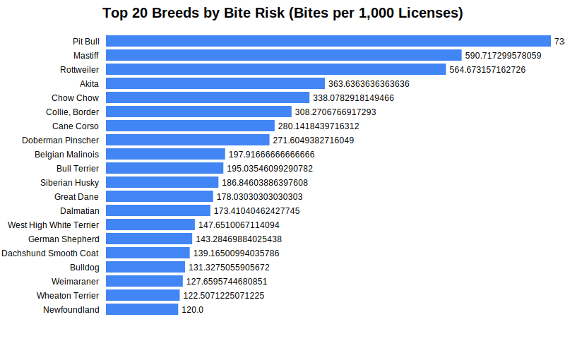
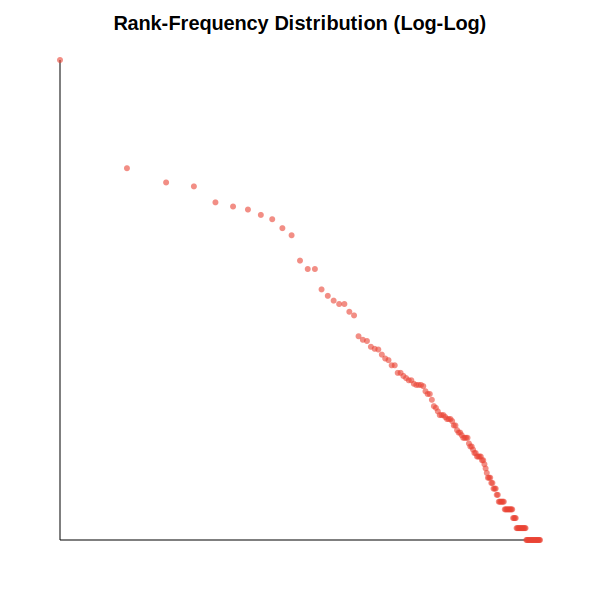

# Dog Bite Analysis Report

Analysis recreating findings from 'The Dogs of New York' using both Bite and Licensing data.

## Risk Analysis Findings
### Pit Bull vs. Maltese Relative Risk
- **Pit Bull Risk**: 0.2142 bites per license
- **Maltese Risk**: 0.0215 bites per license
- **Relative Risk**: **9.96x**

> This calculates how much more likely a Pit Bull is to bite compared to a Maltese, given their registered populations.
> **Verification**: The original article claims ~12.59x. Our calculated value is 9.96x.

## Top 20 High-Risk Breeds
| Rank | Breed | Risk (Bites/License) | Bites | Licenses |
|---|---|---|---|---|
| 1 | Corgi | 0.3147 | 79 | 251 |
| 2 | Hound | 0.2714 | 73 | 269 |
| 3 | Pit Bull | 0.2142 | 7911 | 36941 |
| 4 | Saint Bernard | 0.1698 | 27 | 159 |
| 5 | Rottweiler | 0.1685 | 537 | 3186 |
| 6 | Mastiff | 0.1568 | 166 | 1059 |
| 7 | Akita | 0.1064 | 93 | 874 |
| 8 | Chow Chow | 0.0936 | 106 | 1133 |
| 9 | Cane Corso | 0.0866 | 108 | 1247 |
| 10 | Doberman Pinscher | 0.0797 | 114 | 1430 |
| 11 | German Pinscher | 0.0783 | 9 | 115 |
| 12 | Siberian Husky | 0.0754 | 687 | 9113 |
| 13 | Belgian Malinois | 0.0753 | 54 | 717 |
| 14 | Great Dane | 0.0691 | 60 | 868 |
| 15 | Dalmatian | 0.0667 | 43 | 645 |
| 16 | Collie, Border | 0.0596 | 53 | 890 |
| 17 | Bull Terrier | 0.0594 | 65 | 1094 |
| 18 | German Shepherd | 0.0520 | 1503 | 28894 |
| 19 | Bulldog | 0.0465 | 890 | 19142 |
| 20 | Weimaraner | 0.0385 | 29 | 753 |

## Top 20 Biting Breeds (Frequency)
| Rank | Breed | Bites | % of Total Known |
|---|---|---|---|
| 1 | Pit Bull | 7911 | 34.2% |
| 2 | German Shepherd | 1503 | 6.5% |
| 3 | Shih Tzu | 1208 | 5.2% |
| 4 | Chihuahua | 1137 | 4.9% |
| 5 | Bulldog | 890 | 3.8% |
| 6 | Labrador Retriever | 835 | 3.6% |
| 7 | Yorkshire Terrier | 797 | 3.4% |
| 8 | Poodle | 734 | 3.2% |
| 9 | Siberian Husky | 687 | 3.0% |
| 10 | Maltese | 599 | 2.6% |
| 11 | Rottweiler | 537 | 2.3% |
| 12 | Terrier | 364 | 1.6% |
| 13 | Beagle | 320 | 1.4% |
| 14 | Jack Russell Terrier | 320 | 1.4% |
| 15 | Cocker Spaniel | 234 | 1.0% |
| 16 | Golden Retriever | 212 | 0.9% |
| 17 | Boxer | 197 | 0.9% |
| 18 | Pomeranian | 187 | 0.8% |
| 19 | Shiba Inu | 187 | 0.8% |
| 20 | Mastiff | 166 | 0.7% |

## Visualizations
### Bite Risk (Bites per 1,000 Licenses)

### Bite Frequency (Absolute)
### Rank-Frequency Distribution

